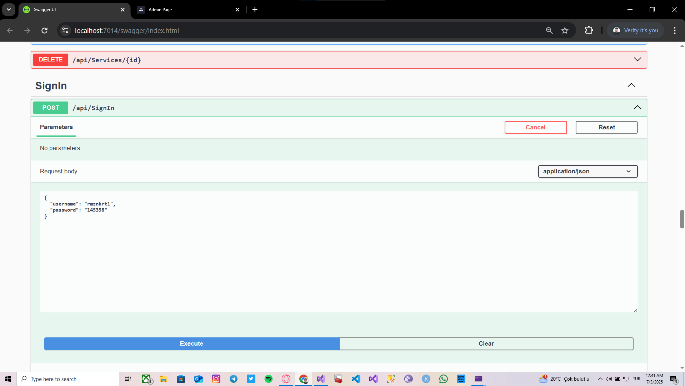
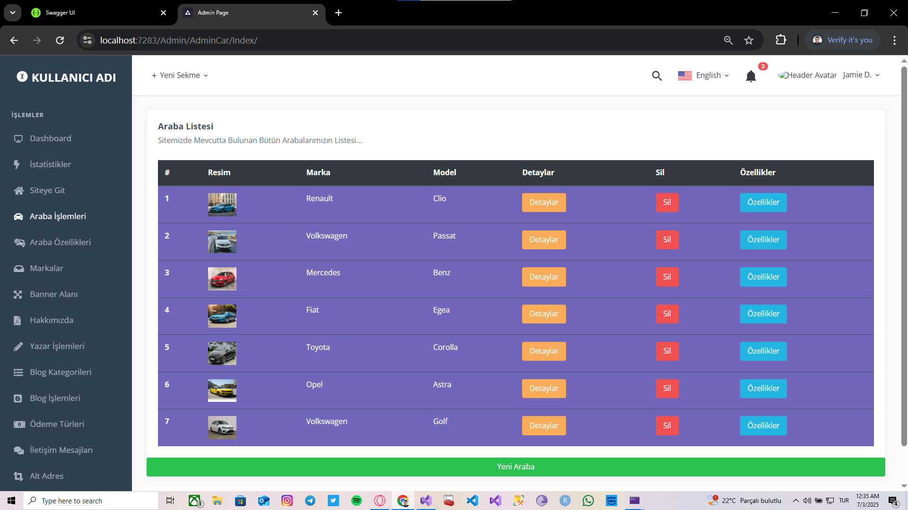

Giriş:
1)Backend tarafında tamamen api kullanıldı.
2)Onion mimarisi üzerinde CQRS,Mediator,Repository tasarım desenlerine çokça yer verilmiştir.
3)Girilen kullanıcı adı ve şifre üzerinde tokenlar üretilip ilgili role sahip kullanıcıların token gerektiren sayfalara girişi sağlanmıştır.
4)Araba fiyatlandırmalarında ise sql üzerinde pivot table sorgusu yazılıp uygun tablo elde edilmiştir.
5)Entity framework linq sorgularla gerekli istatistikler elde edildi.

Projenin Amacı:
müşteriler kiralamak istedikleri araçları uygun lokasyona göre filtreleyip rezervasyon yapabiliyorlar.
Kiralamak istedikleri arabaların özelliklerine,yorumlarına,fiyatlandırma bilgilerine ulaşabiliyorlar.
Araba kiralama ile ilgili blogların bulunduğu ve birçok konuda bilgi sahibi olunabilecekleri bloglarımızın listelendiği panelimiz bulunmaktadır.
Gerekli durumlarda müşterilerimiz sorun yaşadığı taktirde görüşlerini veya şikayetlerini gönderebilecekleri iletişim alanıda bulunmaktadır.
Admin panelinde ise,detaylı istatistiksel verilere ulaşabildiğimiz,arabalar ile ilgili işlemlerin yapıldığı,
Blogların yayımlandığı,müşterilerden gelen mesajların görüntülendiği,kiralanacak arabalara özellik atamasının yapıldığı paneldir.

Kullanılan Teknolojiler Ve Uygulamalar:
 ->Html & Css
 ->JavaScript
 ->Bootstrap
 ->Asp.net Core Api 8.0
 ->Onion Architecture
 ->MSSQL Server 
 ->Entity Framework (Code First)
 ->Json Web Token ile güvenli giriş
 ->Fluent Validation
 ->Ajax
 ->Repository Design Pattern
 ->CQRS Design Pattern
 ->Mediator Design Pattern
 ->Dependency Injection
 ->Authorize & Authentication

 Resimler:
 
 
  
 
 

 
  
   
   
     
    
 

  
  
 
   
    
     
    
     
 
   
  
    
  
    
  
      
       
         
  
   
      
      
    

  
    
 
 
   
       

   
